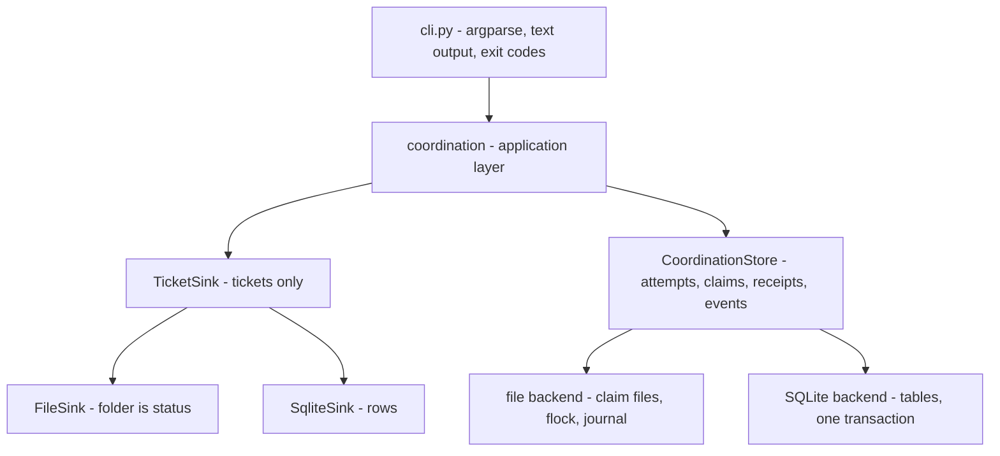

# Shared-directory coordination and file proxy

Status: ready for implementation ticketing. Epic: `shared-directory-coordination`.
Normative companion: [interaction-examples.md](interaction-examples.md) — every
command's input, output and exit code, frozen as acceptance targets.
Read [README.md](README.md) for the owner's mandate and shared rules.

## Outcome

Two independently started agents can work in one checkout through arbite,
without a successful proxy write silently overwriting a competing proxy write.
Every successful write has durable evidence linked to its ticket and work
attempt. Ticket closure releases all its active file claims. The workspace
itself is the visible working state; there is no merge-back step.

Agents are instructed to use arbite for source discovery, reads, and mutations.
Shell commands for tests and for familiar tooling remain available, either
outside arbite or wrapped in `arbite cmd`. A shell, editor or build can bypass
the proxy unless the user's runtime prevents it. Document this honestly: arbite
enforces its own operations, detects observed drift, and supplies hooks for
future restriction. It cannot prove who made a direct filesystem change.

## Owner decisions locked in this session

Date: 2026-09-21. These supersede anything below that reads otherwise; each had a
proposal behind it and a reason to reject the alternative.

- **Text output is the primary interface.** Agents are language-based, so every
  command renders a complete, human-readable account: what happened, what it
  cost, and what to do next. `--json` carries the same facts and is the
  branchable form; it is never the only place a fact exists.
- **No workspace binding command.** The workspace is *derived* from the located
  `.arbite/` directory and the resolved sink. A second root only becomes
  ambiguous once one store is shared across roots, which centralized storage — a
  later, document-only concern — has to introduce. Fields stay on the records so
  the feature needs no history reconstruction; the command does not exist.
- **Scratch transport lives in the project**: `.arbite/scratch/`. Payload paths
  are never outside the project, because an out-of-project write makes every
  harness prompt for permission and breaks unattended automation. `--input -`
  reads stdin for callers that prefer no file at all.
- **Compact scratch lifecycle**: consumed and cleared on success, kept on
  failure, with `arbite scratch list` and `arbite scratch clear NAME|--all`.
  After a success the bytes already live in the receipt, so the copy is only
  transport; after a failure the payload is what lets a model re-apply without
  re-emitting a whole file.
- **Scratch is invisible**: never listed by `file list`/`file search`, never
  claimable, never a ticket, never a stray-file report.
- **`doctor` notes scratch without failing**: a count and size on the report, and
  nothing in the exit code, so a leftover payload is visible but never treated as
  corruption.
- **Events are one-line-per-event and carry ticket, attempt and actor**, so an
  orchestrator's poll needs no second command. `--after <cursor>` resumes and
  `--tail N` bootstraps; there is no `--follow`, because a blocking watcher is a
  sleeping process.
- **Reads are a separate event category**, default-excluded (`--include-reads`
  opts in): a research-heavy agent emits dozens of reads per write.
- **Exit codes 4 (busy) and 5 (stale)** join 0/1/2/3, because those two
  conditions need a different caller response from a genuine error. Passthrough is
  the documented exception, using 125/126/127.
- **`next:` lines are a rendering of an outcome-keyed table**, mirrored into JSON
  as `next_actions`, so the CLI, the tests and the generated guide cannot drift.
- **Tickets are tracked in git; runtime state is not.** `.arbite/coordination/`
  and `.arbite/scratch/` are ignored, everything else under `.arbite/` stays
  committed. Tickets are the development record; evidence is local.
- **Passthrough is best-effort and evaluated, not mandated**: observed mode now,
  guarded mode next, and the question of *requiring* it filed as a wishlist item
  with the event data needed to decide.
- **Digests print as a 12-character prefix** in text, full 64 in JSON, except in
  `doctor`, where comparison is the point.

## Layering



`CoordinationStore` is a second, separately conformance-tested interface. It is
not a superset of `TicketSink`: a ticket is a document that belongs in git and is
readable in `ls`, while a claim is local runtime state that must be discardable
after a crash. Keeping them apart is what lets coordination move to a database or
a server later without touching ticket storage, and it is the only reason an
operation spanning several records can be expressed at all — `TicketSink.update`
is deliberately the single write path for *one* ticket.

## Records and ownership

- Workspace: derived id, canonical project root, resolved store identity.
  Relocated roots are a new workspace, not a mutation. Two roots reaching one
  store is out of scope for this epic and belongs to centralized storage.
- Work attempt: opaque id, ticket id, worker id, workspace id, generation,
  active/finished/released/interrupted state, UTC started/last_activity/ended,
  outcome and handoff. One active attempt per ticket initially. Reopen creates a
  new attempt on the next claim. Existing in-progress tickets require an explicit
  adoption operation; do not invent past activity.
- File claim: workspace id + canonical relative path, ticket and attempt ids,
  generation, acquired time, current state, observed version. Exclusive writer
  ownership is per whole file in v1. Release events are kept after active
  ownership is removed, and reacquiring a path must not reactivate an old token.
- Read observation: attempt/optional actor, operation id, path, content digest,
  observed claim generation, range, timestamp. The digest covers the entire file
  even when a line range is returned. A read receipt says bytes were served, not
  that the model understood them.
- Operation/receipt: operation id, attempt, ticket, actor, operation kind,
  path(s), before/after digest or explicit absent marker, artifact references,
  claim generation, time, result, schema version. Successful changes keep actual
  bytes or an exact reversible representation. Agent prose is separate.
- Event: monotonic per-store cursor, unique event id, kind, subject ids, ticket,
  attempt, actor, operation id, timestamp, versioned payload. Read observations
  are a separate category so ordinary job queries are not flooded.
- Scratch payload: name, bytes, digest, writing attempt, created time. Transport,
  not a mutation and not a record: it never authorizes anything and never appears
  in discovery.

Keep a current-state claim index plus append-only operation and event history; do
not replay the whole log for every claim check. Append-only is an application
contract, not tamper-proof storage, and evidence is not deleted on ticket closure.

## Agent-facing surface

Revised from the earlier proposed spelling where this session changed it; the
frozen transcripts live in [interaction-examples.md](interaction-examples.md).

```
arbite workspace show [--json]
arbite file list [PATH] [--count N] [--after PATH] --json
arbite file search PATTERN [PATH] [--count N] [--after PATH:LINE] --json
arbite file read PATH --ticket T --attempt A [--lines START:END] [--fail-if-busy] --json
arbite file claim PATH... --ticket T --attempt A --json
arbite file claims [--all] --json
arbite file write PATH --ticket T --attempt A --read-token R --input NAME|- [--keep] --json
arbite file edit PATH --ticket T --attempt A --read-token R --edits NAME|- [--keep] --json
arbite file remove PATH --ticket T --attempt A --read-token R --json
arbite file rename SOURCE DEST --ticket T --attempt A --read-token R [--expect-dest DIGEST] --json
arbite file release PATH... --ticket T --attempt A --reason TEXT --json
arbite scratch list | clear [NAME...] | clear --all --json
arbite cmd [--ticket T --attempt A] [--claim PATH...] [--shell] -- CMD... --json
arbite events [--after CURSOR | --tail N] [--include-reads] --json
arbite receipt OP --json
arbite changes T [--all] --json
arbite attempt adopt T --agent A --json
```

Commands are one-shot, JSON-capable, and usable without an LLM SDK. Payload temp
files are transport, not project mutations. Exact parser names may be refined
during implementation; the semantics and the transcripts are the requirements.

Reads do not take an exclusive lock. A read of a file claimed by another attempt
returns bytes with an explicit busy owner, observed version and non-writable
receipt; `--fail-if-busy` refuses instead, to avoid spending tokens on bytes that
cannot be used. A writer must claim first and read again after claim acquisition:
pre-claim observations do not authorize a write. A successful write returns an
updated version but requires a fresh proxy read before another mutation, keeping
the first contract simple.

Every mutation checks ticket state, current attempt, claim generation and the
expected whole-file digest while holding the relevant operation lock. Two writes
using one read token cannot both succeed. A mismatch returns `stale_read` and
changes no bytes. Direct external edits also invalidate observed versions when
detected, but no check eliminates a race with an unrestricted external writer.

Whole-file write supports creation via a read/probe receipt for an absent path.
Existing-file writes preserve supported permissions. Targeted edit accepts an
ordered batch of exact old/new text substitutions with explicit occurrence rules;
ambiguous, absent or overlapping selections fail with no partial write. Apply the
batch to the validated in-memory version, then replace once. No fuzzy patching,
AST edit, or concurrent region ownership in v1. UTF-8 text editing must preserve
untouched bytes and newline conventions; binary whole-file writes use byte
payloads and digests, and binary receipts need not contain a textual diff.

Remove and rename exist so agents do not fall back to shell writes. Rename claims
both source and destination, requires absence or an explicit destination version,
and records both paths. No recursive directory deletion in v1. Parent creation is
constrained to safe in-root directories. Unsupported file types and operations
fail clearly rather than following arbitrary links.

List/search provide bounded output, deterministic pagination, truncation markers,
and path/version metadata. A truncation hint names a token that appears in its own
output, so the continuation is executable. Discovery does not count as a
write-authorizing read. Initial search is text and path discovery; import tracing,
dependency analysis and semantic reads are extension points.

## Exit codes and next actions

| Code | Meaning | Correct caller response |
| --- | --- | --- |
| 0 | success; state changed or bytes served | continue |
| 1 | error: bad input, not found, policy refusal | fix the command |
| 2 | query ran, matched nothing | nothing to do |
| 3 | `doctor` found problems | repair |
| 4 | busy — a live claim or attempt holds it; nothing changed | pick other work |
| 5 | stale — token, digest or generation is not current; nothing changed | re-read, then retry |

`arbite cmd` returns the wrapped command's own exit code, so arbite-level
refusals use 125 (refused before running), 126 (unsupported invocation) and 127
(tool not found). No other codes are safe: 0–5 are all reachable as tool results,
and a caller that cannot distinguish "the tool failed" from "arbite refused" has
lost the ability to branch.

Every non-zero outcome ends with a `next:` line naming exact commands, rendered
from a table keyed by outcome kind. A hint is computed from the state at failure
time, may only reference tokens printed by the same command, and never suggests
waiting, retrying a busy path, or working around arbite with the shell.

## Paths and canonicalization

Canonicalize against the project root. Reject traversal outside root, protected
arbite state, `.git` metadata, special files, and symlink components in v1; reject
hard-linked mutation targets rather than let aliases evade claims. Account for
case-insensitive filesystems where supported. Validate again at use time and use
safe directory and file handles where available; document the supported-platform
boundary rather than claim protection from hostile local filesystem races.
Rename and create must validate missing destination components.

Everything the file sink scans as a ticket must stay distinguishable from
coordination state: claim records, receipts, artifacts, journal entries and
scratch payloads use non-`.md` files inside reserved directories that the ticket
scan skips, so a stray record can never be read as a ticket and a scratch payload
can never be claimed.

## Claims, conflicts and waiting

Acquire requested claim sets all-or-nothing in deterministic canonical order. If
an agent already owns claims and requests another busy path, return `file_busy`
promptly with the holder's ticket, attempt and generation, plus available next
actions. No automatic waiting and no claim stealing. If progress requires
yielding, preserve completed edits, release the ticket with a handoff, and select
another ticket. A new worker reads current bytes; release never silently reverts
partial work. No automatic deadlock solver or promise of starvation freedom in v1.

The acquisition loop is where deadlock is avoided or introduced, so the ordering
rule is a requirement rather than an implementation detail: canonical order,
all-or-nothing, rollback on failure, and no partial claims left behind.

## Scratch transport

- `--input NAME` and `--edits NAME` resolve inside `.arbite/scratch/`; `-` means
  stdin. A path outside the project is refused, because the documented workflow
  must never need one.
- Success consumes the payload and clears it, reporting that the bytes are
  retained as a receipt artifact. Failure keeps it and says so, so a recoverable
  error does not force a model to re-emit a file. `--keep` opts out.
- `arbite scratch list` shows name, size, age and writing attempt; `arbite scratch
  clear NAME...` and `--all` clear deliberately.
- Scratch is excluded from discovery, scanning, claims, `changes` and doctor's
  stray-file findings, and appears on the doctor report only as a count and size
  note that never affects the exit code.

## Passthrough: `arbite cmd`

Agents are trained on `grep`, `sed`, `mv` and friends, and using what they already
do well increases success rates. `arbite cmd` wraps those invocations so the
change is captured anyway. It is deliberately the lowest-fidelity path in the
proxy, and its output says so.

**Observed mode (default).** `arbite cmd [--ticket T --attempt A] -- CMD...` runs
the command, snapshots a digest manifest of managed paths before and after, and
writes receipts for created, modified and removed paths plus a `passthrough.exec`
event carrying tool, argv hash, exit code and duration. It claims no exclusivity:
another writer could interleave, and the receipt says observed rather than
exclusive. Read-only tools are recorded as execution events only, because arbite
cannot know which files a program read.

**Guarded mode (`--claim PATH...`).** The caller declares the paths the command
may touch. Arbite claims them all-or-nothing first, refuses before running if any
is busy, then verifies that every observed change falls inside the claimed set.
A change outside it is reported as `unclaimed_write`: recorded, attributed
honestly, and left in place, because arbite does not undo a command it did not
perform. Claims are released when the command completes unless the caller asks to
hold them.

**Refusals and limits.** argv execution by default, with `--shell` opting into
`sh -c` and stating that redirections happen in the shell and become visible only
after the fact. Interactive commands are refused. Long-running and background
processes are out of scope. Output capture is bounded. A guarded command cannot
become the bypass that quietly evades claims, which is why it refuses rather than
warns.

**Why observed mode ships first.** The `passthrough.exec` events are the evidence
needed to decide whether to *require* passthrough later: which tools agents
actually reach for, how often a change escapes a claimed set, and how often a
guarded claim would have blocked real work. Mandating it now would be a policy
decision taken without data.

## Lifecycle and administrative operations

- Claim ticket: check readiness in the same coordinated transaction as assignment
  and attempt creation. List-next is a convenience over the same operation.
- Close: validate actor and attempt, reconcile pending operations, finalize the
  attempt's receipt manifest, mark closed, release its file claims. No observer
  may successfully mutate under an old token after close succeeds.
- Release and shelve: end the attempt, release file claims, retain partial work
  and evidence. Handoff and reason are recorded. Block also ends the active
  attempt and releases claims in v1; unblock creates a fresh attempt if resuming.
- Explicit file release: keep the attempt, revoke that file token; later
  reacquisition requires a new read.
- Forced takeover: explicit administrative reason, revoke the old attempt
  generation, finalize interruption evidence, release claims, start a new attempt.
  A stopped or absent worker is never inferred from timestamps.
- Reopen: keep old attempts; no old file claims are resurrected.
- Delete: reject tickets with active claims or attempts. Refuse destructive
  deletion with an explanation rather than cascading away change history.
- Generic set, status and assignee commands must route through these transitions
  or refuse them with the correct lifecycle command. No backdoor through force.

A direct dependency change or reopen racing a new claim must have a defined serial
order. Claims check readiness at acquisition; reopening a completed prerequisite
emits an invalidation event but does not secretly undo running work.

## Durability and recovery

The workspace and the store are separate durability domains, and a SQL
transaction cannot atomically commit both. Use a recoverable write protocol:
persist intent and before/after artifacts, stage bytes, verify claims and
versions, apply the filesystem operation, then finalize the receipt. Operation ids
deduplicate retries. Serialize lifecycle operations with in-flight file
operations.

Inject failures before and after each boundary, including file replacement
followed by sink failure and a rename interrupted between paths. On the next
relevant operation, detect incomplete intent and reconcile using recorded
versions. If observed bytes match neither before nor after, report drift and
preserve evidence; do not guess, overwrite, or release ownership as if the
operation completed. `doctor` exposes pending operations and repairs only
unambiguous cases. There is no recovery daemon. Errors identify whether bytes may
already have changed and which operation must be inspected or retried.

The file sink needs process-safe serialization and recoverable multi-record
updates; the existing single-ticket exclusive-create logic is insufficient for
the new invariants. SQLite uses real transactions for store-local state. A small,
coarse local coordination lock is acceptable initially, and its implementation
must handle process death without inventing an agent-staleness policy. Do not hold
an operation lock for an agent's whole ticket duration; durable claims do that
job. Two kinds of mutex, never conflated: an ephemeral lock released by the OS on
process death, and a durable claim record released by a lifecycle command.

## Evidence, retention and git policy

Capture mutation evidence automatically, including create, delete, rename and
binary changes, not only the final ticket diff. Provide ordered receipts and a net
change view per attempt and ticket, including edit-then-revert. Store content once
by digest where practical, verify artifacts, and make size limits explicit. If
required evidence cannot be stored, fail before modifying bytes. Default
exclusions for private or generated paths must fail clearly rather than produce
unrecorded proxy writes. No automatic LLM summary and no remote upload.

Tracked in git: tickets, agent scratchpads, planning documents. Ignored:
`.arbite/coordination/`, `.arbite/scratch/`, `.arbite/arbite.db*`, the lock file.
Consequences accepted deliberately: evidence is local and dies with the machine
unless the owner keeps it, and a devlog is generated from tickets plus a receipt
summary taken before pruning, never from the coordination store. No artifact
garbage collection until retention rules are designed; disk growth is documented.

Non-proxy tool writes are unattributed drift. Build and test output is not
ticket-attributed. Keep generated output outside managed source paths, or ingest it
explicitly as an observed artifact with limited attribution.

## Implementation slices

Each slice is a ticket. Scenario IDs are from
[interaction-examples.md](interaction-examples.md) and are the slice's acceptance
targets; existing regression tests must keep passing or be deliberately updated
for a documented safety restriction. Sibling tickets may touch the same files —
that dependency order is about correctness, not about disjoint source edits, so
until the proxy exists, implementers coordinate edits manually or work serially.

**C01 — Define versioned coordination records and application operations.**
Records for workspace, attempt, claim, read observation, operation receipt,
artifact and event; schema revisions, opaque ids, UTC times, a JSON result and
error vocabulary including `busy` and `stale`; an application layer for guarded
multi-record operations so policy does not live in argparse or SQL. Acceptance:
legacy tickets and timestamps stay readable; one authoritative store binding per
workspace is modeled; sink transaction and recovery interfaces are defined.
Scenarios: WS1, WS2, DR4.

**C02 — Implement transactional coordination storage and durable events.**
Record revisions, store-local multi-record operations, event append with a stable
cursor, and the `arbite events` read surface. File sink uses a recoverable journal
and process serialization; SQLite uses transactions. A coarse operation lock is
acceptable; no ticket-duration lock. Acceptance: concurrent updates cannot lose
fields under unchanged status; state and events commit together or recover
deterministically; process death leaves no permanent lock; equivalent outcomes on
both sinks. Scenarios: EV2, EV3, EV4, EV5, EV7.

**C03 — Create work attempts and guard every ticket acquisition path.**
Create and end durable attempts; enforce readiness atomically with acquisition;
route direct claim, `list next --claim`, batch claim, set, set-status, force,
release, block, shelve and reopen through the application layer; add adoption for
legacy in-progress tickets and generation revocation for takeover. Acceptance:
nothing can bypass unmet dependencies, placeholder classification, an invalid
status, or another active attempt; claim versus dependency-edit and reopen races
have a documented serial outcome; activity timestamps are stored with no expiry
logic. Scenarios: CL1–CL6, LC5, RC1.

**C04 — Implement canonical paths and exclusive file claims.**
Claim records with generations and observed versions; canonical path validation
against the project root; all-or-nothing acquisition in canonical order with
rollback; `file claims` inspection; release and re-acquisition semantics.
Acceptance: two claims on one path produce one winner; a conflict leaves no
partial claims; aliases, protected paths and escapes are refused. Scenarios: FC1–
FC8, LS6, RD5.

**C05 — Build the file-operation intent journal and recovery engine.**
Persist intent and before/after artifacts, stage bytes, verify claims and
versions, apply, finalize; operation-id deduplication; incomplete-intent detection
and reconciliation; `doctor` exposure and `--fix` for the unambiguous cases only.
Acceptance: injected failures at each boundary recover honestly; drift reports
rather than guesses; no recovery daemon. Scenarios: DR1, DR2, RC2.

**C06 — Expose bounded discovery and versioned reads.**
`file list`, `file search` with deterministic ordering, counts, truncation and
continuation tokens; `file read` with whole-file digests, ranges, read tokens,
busy banners and `--fail-if-busy`; scratch and coordination paths excluded.
Acceptance: discovery never authorizes a write; a foreign read cannot mint a
writable token; a range never narrows the digest. Scenarios: LS1–LS5, RD1–RD4.

**C07 — Expose version-checked writes and exact edits.**
Whole-file writes with read-token and digest verification; creation via absent
probe; permission preservation; exact edit batches with occurrence rules and
no-partial-write failure; binary payloads; ordered `next:` hints for `stale_read`
and `no_claim`. Acceptance: one token authorizes one mutation; a stale token
changes no bytes; ambiguous edits fail cleanly. Scenarios: WR1, WR4–WR7, ED1–ED3,
BY2.

**C08 — Expose tracked creation, removal and rename.**
Remove and rename with evidence; rename claims both paths and records both;
destination existence requires an explicit expected version; no recursive
directory deletion. Acceptance: remove and rename round-trip through receipts;
refusals explain the manual alternative. Scenarios: RN1–RN4, FC4.

**C09 — Add scratch payload transport.**
`--input`/`--edits` resolved inside `.arbite/scratch/`, stdin support, consume on
success, keep on failure, `scratch list|clear`, exclusion from discovery, scanning
and doctor findings, and the doctor count-and-size note. Acceptance: no documented
path writes outside the project; a failed write leaves the payload usable; scratch
never changes an exit code except through the command that manages it. Scenarios:
SC1–SC5, DR3.

**C10 — Cascade ticket lifecycle through file ownership and receipts.**
Close, submit, accept, release, block, shelve, reopen, delete and takeover each
end or preserve attempts and release claims correctly; generic setters route
through the lifecycle or refuse. Acceptance: no observer mutates under an old
token after close; reopen resurrects nothing; partial work stays visible.
Scenarios: CL7, LC1–LC4.

**C11 — Expose change receipts and net ticket change views.**
`arbite receipt`, `arbite changes` with `--all`, artifact verification, and the
net-versus-ordered distinction that keeps edit-then-revert visible. Acceptance: a
receipt reproduces before and after digests and holds the bytes; the net view
never hides an operation that was reverted. Scenarios: EV1, EV6.

**C12 — Add coordination migrations, export and integrity recovery.**
Move coordination records between sinks with the ticket set, preserve attempts,
claims, receipts and events while quiescent, refine integrity checks per sink, and
export a receipt summary suitable for a devlog before any pruning. Acceptance: a
file to SQLite to file round trip preserves records and outcomes; checks are shared
where they mean the same thing and per-sink where they do not.

**C13 — Add passthrough command observation.**
`arbite cmd` in observed mode: argv execution, `--shell`, bounded output, before
and after manifest diff, receipts for observed changes, `passthrough.exec` events,
exit-code passthrough with 125/126/127 for arbite's own refusals, and honest
`observed, not exclusive` reporting. Acceptance: a familiar tool's changes are
captured without the agent changing habits; refusals never run the command.
Scenarios: PC1, PC5, PC6.

**C14 — Add passthrough guarded mode.**
`--claim PATH...`: all-or-nothing claim before running, refuse when busy,
verify observed changes against the claimed set, report `unclaimed_write` without
undoing anything, release on completion. Acceptance: passthrough cannot bypass
claim ownership; an escape is detected and attributed. Scenarios: PC2, PC3, PC4.

**C15 — Validate and document the shared-directory proxy workflow.**
Update `README.md` scope, [`docs.py`](../../src/arbite/docs.py) and the generated
`.arbite/AGENTS.md` so the guide describes exactly the commands that exist, states
the honest limits, and tells agents to prefer the proxy while acknowledging a
shell can bypass it. Multiprocess and crash-injection acceptance across both
sinks. Acceptance: every scenario in the examples doc passes; the guide claims
nothing the active sink cannot do; the guide is omitted or trimmed when the
selected sink has no coordination backend. Scenarios: BY1, BY3, the full set,
both-sink conformance.

The two job-board epics (`B01`–`B08`) keep their existing keys and dependencies;
`B03`'s dependency on the old lifecycle ticket now resolves to C10. The wishlist
ticket for *requiring* passthrough carries no scenarios: it is a policy question
whose evidence is the `passthrough.exec` stream from C13.

## Required scenarios

The frozen transcripts plus these, which are not single commands and therefore
live here: two workers race for one ticket and one file and exactly one wins;
different files are owned independently; a stale read is rejected and changes no
bytes; a close races a write with one documented serial outcome; a worker tries to
write after release or takeover and is refused; a multi-file claim conflict leaves
no partial claims; a crash before or after replacement recovers honestly; a
foreign read is flagged and cannot authorize a mutation; aliases cannot bypass
claims; rename, delete, create and binary evidence round-trip; block and release
leave partial bytes visible for the next worker to re-read; existing tickets
migrate without fabricated history; attempts, events and artifacts survive a
file to SQLite to file transfer while quiescent.

## Deferred decisions

No shared-region editing, import analysis, agent authentication, sandbox setup,
stale timers, heartbeat worker, or automatic takeover. No mandate on passthrough
until the observed data is in. No read observations for undeclared paths. No
artifact retention or garbage-collection policy yet. Preserve attempt activity,
generation, actor and operation fields so those features need not reconstruct
missing history. Runtime enforcement and smarter reads are future additions to
this same proxy, not reasons to bypass it now.
